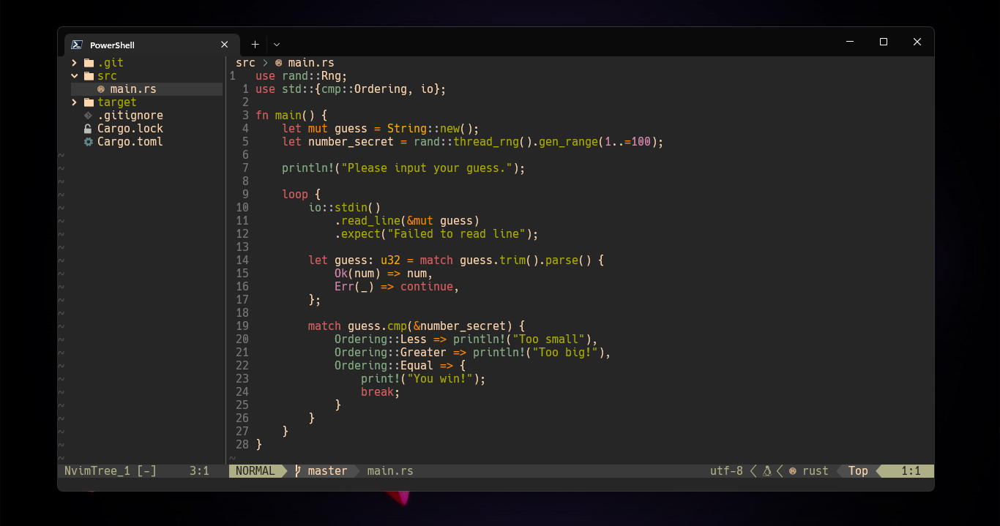

## Local

### Install packer

```shell
$ git clone https://github.com/wbthomason/packer.nvim "$env:LOCALAPPDATA\nvim-data\site\pack\packer\start\packer.nvim"
```

### Clone the repo

```shell
$ git clone https://github.com/jeffercbs/nvim-config.git $HOME\AppData\Local\nvim --depth 1 && nvim
```

### run packer

```shell
:PackerSync
```
